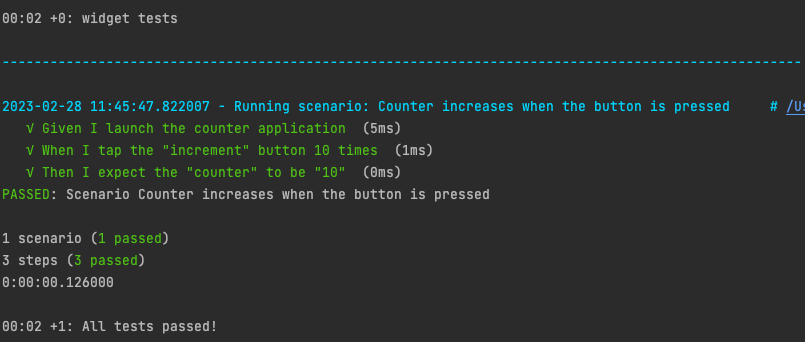
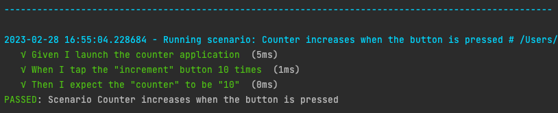
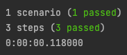
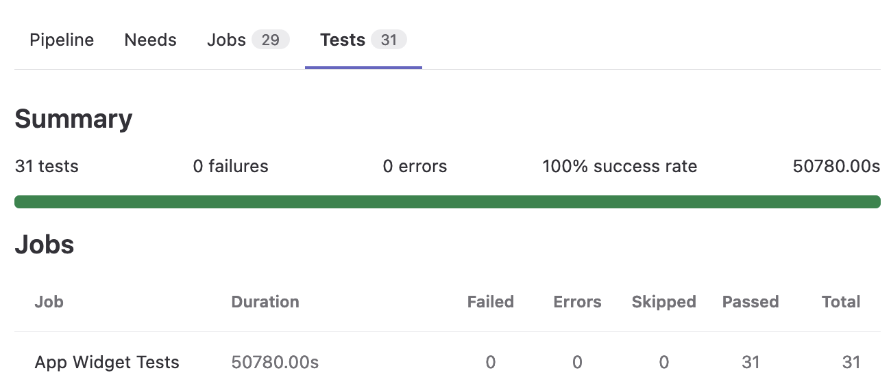
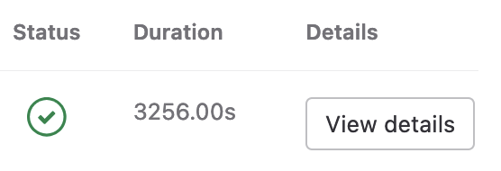

<!-- 
This README describes the package. If you publish this package to pub.dev,
this README's contents appear on the landing page for your package.

For information about how to write a good package README, see the guide for
[writing package pages](https://dart.dev/guides/libraries/writing-package-pages). 

For general information about developing packages, see the Dart guide for
[creating packages](https://dart.dev/guides/libraries/create-library-packages)
and the Flutter guide for
[developing packages and plugins](https://flutter.dev/developing-packages). 
-->

A BDD-oriented widget test runner using [Cucumber](https://cucumber.io/docs/guides/overview/).
Use all the power and flexibility of the [gherkin](https://pub.dev/packages/gherkin) package with
[flutter test widget](https://docs.flutter.dev/cookbook/testing/widget/introduction).

Write your own steps using [gherkin syntax](https://cucumber.io/docs/gherkin/reference/) in `.feature` files,
then create associated [step definitions](https://cucumber.io/docs/guides/overview/#what-is-gherkin),
set up the configuration and you are ready to describe actions and assertions of your application's widgets.

---

## Table of Contents

<!-- TOC -->

* [Table of Contents](#table-of-contents)
* [-- Features](#---features)
* [-- Getting started](#---getting-started)
  * [🥒 Add `gherkin_widget_extension` dependency](#-add-gherkin_widget_extension-dependency)
  * [✏️ Write a scenario](#%EF%B8%8F-write-a-scenario)
  * [🔗 Declare step definitions](#-declare-step-definitions)
  * [⚙️ Add some configuration](#%EF%B8%8F-add-some-configuration)
    * [Package distinctive features](#package-distinctive-features)
      * [`..hooks`](#hooks)
      * [`..reporters`](#reporters)
  * [🧪 Set up the test runner](#-set-up-the-test-runner)
  * [🪄 Run your tests](#-run-your-tests)
  * [🎬️ Let's go!](#%EF%B8%8F-lets-go)
* [-- Usage](#---usage)
  * [🌎 `WidgetCucumberWorld` advantages](#-widgetcucumberworld-advantages)
  * [🪣 Buckets for data](#-buckets-for-data)
  * [👁️ Don't forget the accessibility](#%EF%B8%8F-dont-forget-the-accessibility)
  * [🧩 `WidgetObject` pattern and usage of `TestWidgets` class](#-widgetobject-pattern-and-usage-of-testwidgets-class)
  * [🔄 Loading data for widgets with `JsonLoader`](#-loading-data-for-widgets-with-jsonloader)
  * [📸 A Hook for screenshot and widget tree rendering](#-a-hook-for-screenshot-and-widget-tree-rendering)
  * [📋 Widget test reporters](#-widget-test-reporters)
    * [`MonochromePrinter`](#monochromeprinter)
    * [`WidgetStdoutReporter`](#widgetstdoutreporter)
    * [`WidgetTestRunSummaryReporter`](#widgettestrunsummaryreporter)
    * [`XmlReporter`](#xmlreporter)
    * [Add reporters in test configuration](#add-reporters-in-test-configuration)

<!-- TOC -->

---

## -- Features

* Run your tests written with gherkin within a widget test context,
* Expose a `CucumberWorld` named `WidgetCucumberWorld` designed for widget tests with its buckets to store and share
  data through steps,
* ✨ Accessibility-friendly : search widget by semantic labels **AND** check its full semantic,
* Provide a Json loader to help building widget using Json data,
* Screenshot and widget tree dumped in a file on test failure,
* [Gherkin reporters](https://pub.dev/packages/gherkin#reporters) adapted for widget tests,

---

## -- Getting started

Knowledge on Gherkin syntax and Cucumber framework helps, documentation available
here: https://cucumber.io/docs/gherkin/.

This README is based on some [gherkin](https://pub.dev/packages/gherkin) README examples.

### 🥒 Add `gherkin_widget_extension` dependency

In the `pubspec.yaml` of your project, add the `gherkin_widget_extension` library in `dev_dependencies` :

```yaml
gherkin_widget_extension: ^0.0.2
```

Then run `pub get` to download the dependency.

### ✏️ Write a scenario

In the `test` folder, create a `features` folder. If there is no `test` folder, then create it.
In the `features` folder, create a `feature` file such as `counter.feature` and write your first scenario:

```gherkin
Feature: Counter
  The counter should be incremented when the button is pressed.

  @my_tag
  Scenario: Counter increases when the button is pressed
    Given I launch the counter application
    When I tap the "increment" button 10 times
    Then I expect the "counter" to be "10"
```

Next step: implementation of step definitions.

### 🔗 Declare step definitions

Step definitions are like links between the gherkin sentence and the code that interacts with the widget.
Usually `given`
steps are used to set up the test context, `when` step(s) represents the main action of the test (When the user
validates
the form, When the user applies his choice, ...) and the `then` steps assert everything assertable on the screen
(text, state, semantics, ...).

In the `test` folder, create a `step_definitions` folder and within this folder, create a `steps.dart` file and start
implementing step definitions:

```dart
import 'package:gherkin/gherkin.dart';
import 'package:gherkin_widget_extension/gherkin_widget_extension.dart';

StepDefinitionGeneric<WidgetCucumberWorld> givenAFreshApp() {
  return given<WidgetCucumberWorld>(
      'I launch the counter application', (context) async {
    // ...
  });
}
```

> #### 💡 _Advice_
>
> For better understanding, one of good practices advises to split step definitions files according to gherkin keywords
> (all Given step definitions within the same file `given_steps.dart`, all When step definitions within the same file
> `when_steps.dart`, etc...). Organizing those files into folders representing the feature is a plus.

### ⚙️ Add some configuration

The [gherkin](https://pub.dev/packages/gherkin) offers a wide list of customizable properties
available [here](https://pub.dev/packages/gherkin#configuration).

Within the folder `test`, create a new file named `test_setup.dart` to declare your own test configuration :

```dart
TestConfiguration TestWidgetsConfiguration({
  String featurePath = '*.feature',
}) {
  return TestConfiguration()
    ..features = [Glob(featurePath)]
    ..hooks = [WidgetHooks(dumpFolderPath: 'widget_tests_report_folder')]
    ..order = ExecutionOrder.sequential
    ..stopAfterTestFailed = false
    ..reporters = [
      WidgetStdoutReporter(),
      WidgetTestRunSummaryReporter(),
      XmlReporter(dirRoot: Directory.current.path)
    ]
    ..stepDefinitions = [
      givenAFreshApp(),
      whenButtonTapped(),
      thenCounterIsUpdated()
    ]
    ..defaultTimeout =
    const Duration(milliseconds: 60000 * 10);
}
```

More explanation about those options [here](https://pub.dev/packages/gherkin#configuration).

#### Package distinctive features

##### `..hooks`

The package provides a hook class `WidgetHooks` which implements the `Hook` class supplied by
the [gherkin package](https://pub.dev/packages/gherkin#hooks). This class handles the widget test reporting such as
screenshot and widget tree rendering.

More information [here](#-a-hook-for-screenshot-and-widget-tree-rendering).

##### `..reporters`

[`Reporters`](https://pub.dev/packages/gherkin#reporting) provided by the gherkin package have been enriched in this
package:

* `WidgetStdoutReporter`: prints each gherkin step with its status in terminal logs
* `WidgetTestRunSummaryReporter`: prints the summary of the entire test execution in the terminal log at the end of test
  execution.
* `XmlReporter`: generates a XML test execution report in XML format, useful for GitLab CI tests reporting.

More information [here](#-widget-test-reporters).

### 🧪 Set up the test runner

Create a new file `widget_test_runner.dart` in the `test` folder and call the test runner method:

```dart
void main() {
  testWidgetsGherkin('widget tests',
      testConfiguration: TestWidgetsConfiguration(featurePath: "test/features/*.feature"));
}
```

Create another file named `flutter_test_config.dart` in the `test` folder and declare the test executing configuration
to enable font loading _(required for screenshots)_:

```dart
Future<void> testExecutable(FutureOr<void> Function() testMain) async {
  await loadAppFonts();
  await testMain();
}
```

### 🪄 Run your tests

Open a terminal and execute the file you created before:

```shell
flutter test test/widget_test_runner.dart
```

You should see these kind of logs:


### 🎬️ Let's go!

Write as many gherkin scenarii as you need, play with cucumber tags to run some of your scenarii, and explore all
options the [gherkin](https://pub.dev/packages/gherkin) package supply.

---

## -- Usage

This package adds various options to the base package `gherkin` in order to make the test automation easier.
Below the list and explanations of those new features.

### 🌎 `WidgetCucumberWorld` advantages

The gherkin package exposes a `CucumberWorld` to store data and share them with all the steps within the same scenario.
A `CucumberWorld` is unique: there is only one per scenario, freshly created at the beginning and destroyed once the
scenario is done, no matter its status.
You will find more information about the goal of
the `CucumberWorld` [here](https://pub.dev/packages/gherkin#createworld).

The class `WidgetCucumberWorld` inherits from the `CucumberWorld` class of the gherkin package and exposes the following
items:

* `WidgetTester tester`: allows to interact with the widget (tap, pump, get elements, ...),
* `SemanticsHandle semantics`: created at the beginning of the test, enables interactions with the `Semantic` widget,
* `String scenarioName`: stores the current scenario name - used for reporting,
* `String json`: stores the Json data used to build the widget,
* `Bucket bucket`: stores test data coming from the steps variables, more information in the next paragraph.

No need to create a `WidgetCucumberWorld` object, the package provides one named `currentWorld`, accessible from the
`context` object:

```dart
context.world.tester;
```

### 🪣 Buckets for data

> If `CucumberWorld` were the test's backpack, `Buckets` would be its pockets.

`Buckets` allows you to organize your data in the `CucumberWorld`. Indeed, if your application has divergent use cases,
such as tickets sells, customer account or traffic information, etc., you might not want to store all test data together
within the `CucumberWorld`: you may use `Buckets` to store data according to their business domain (ex:
TicketSellBucket,
AccountBucket, ...).

`Buckets` are abstract and generic, so to use them, you need to create a class which implements the `Bucket`
class:

```dart
class ExampleBucket implements Bucket {
  String? buttonAction;
  int nbActions = 0;
}
```

In this example, the bucket name is `ExampleBucket` and stores two values: the name of the button to interact with,
and the number of times it was tapped.

Before storing data into a `Bucket`, it requires to be initialized through the `WidgetCucumberWorld` object named
`currentWorld`:

```dart
currentWorld.bucket =

ExampleBucket();
```

Then use `currentWorld` for setting and accessing to the `Bucket`'s data:

```dart
currentWorld.readBucket<ExampleBucket>
().nbActions = count;
```

Keep in mind that bucket type is required to use it and access to its data (here `<ExampleBucket>`).

### 👁️ Don't forget the accessibility

Accessibility is essential in mobile application and must be tested as well. This package provides a method to test
widget semantics:

```dart
Finder widgetWithSemanticLabel(
  Type widgetType,
  String semanticLabel,
  {bool skipOffstage = true,
  Matcher? semanticMatcher}
)
```

This method allows you to find a widget by its type, its semantic label and its full semantics:

```dart

final widgetToFind = find.widgetWithSemanticLabel(Checkbox, "Checkbox label",
    semanticMatcher: matchesSemantics(
        hasEnabledState: true,
        label: "Checkbox label",
        hasTapAction: true,
        isEnabled: true,
        isFocusable: true,
        textDirection: TextDirection.ltr,
        hasCheckedState: true,
        isChecked: true));

expect(widgetToFind, findsOneWidget);
```

The `expect` raises an `AssertionError` if no corresponding widget exists.

### 🧩 `WidgetObject` pattern and usage of `TestWidgets` class

Organizing the test code according the "Widget Object" pattern can be helpful for maintenance and code clarity.
The Widget Object pattern (invented for this package) is strongly inspired by the PageObject pattern and applied to
Flutter widget tests.

In test automation, the Page Object pattern requires to create one class per page (or screen) which gathers not only all
methods interacting with this page (click, check, ...) but also selectors to this page (how to target a given element on
this page). This way, understanding and maintenance are eased.

In the widget test context, pieces of screen are tested (or portion of a widget tree), not pages. But, keeping the page
object logic is still helpful.

The abstract class `TestWidget` can be used as an interface to "widget object" classes to force the implementation of the
most important method:

* `pumpItPump()` - indicates how pump the widget to test

Example:

```dart
class MyWidgetObject implements TestWidgets {
  @override
  Future<void> pumpItUp() async {
    var widgetToPump = const MaterialTestWidget(
      child: MyApp(),
    );
    pumpWidget(widgetToPump);
  }
}
```


### 🔄 Loading data for widgets with `JsonLoader`

Applications often use data coming from an API to build components in its screens and widget test cannot depend on
API and its potential slowness and instabilities. Widgets tests are expected to be reliable and as fast as possible.
This way, API Json responses can be stored into files and loaded through the provided `JsonLoader` to help building the
widget to test.

```dart
var jsonMap = awaitJsonLoader.loadJson("path/to/json/folder");
```

`jsonMap` contains a map where keys are json filenames and values the json files content.

### 📸 A Hook for screenshot and widget tree rendering

> 📣 At least one font must be declared in the `pubspec.yml` to have nice and understandable screenshots (Squares will
> replace fonts otherwise).
>
> 📣 The `flutter_test_config.dart` must exist at the root of `test` directory (
> See [🧪 Set up the test runner](#-set-up-the-test-runner) paragraph).

Hooks contain methods executed before or after specific milestones during a test driven by Cucumber (before/after
scenario,
before/after steps, ...). More information about Hooks [here](https://pub.dev/packages/gherkin#hooks).

This package supplies a Hook named `WidgetHooks` to improve reporting and provide more information on test failure such
as screenshots and widget tree rendering. Add this Hook in your `TestConfiguration` to enjoy its features :

```dart
TestConfiguration()
  ..hooks = [
    WidgetHooks(dumpFolderPath:'widget_tests_report_folder')
  ]
```

**Parameter `dumpFolderPath` is mandatory**: it represents the report folder where screenshots and widget rendering will
be stored on test failure.

> 📣 This package provides a custom Widget called `MaterialTestWidget`. This widget must encapsulate the widget to pump
> to enable screenshots and widget rendering.

### 📋 Widget test reporters

The package includes several reporters optimized for widget tests and a custom log printer.

#### `MonochromePrinter`

This class extends the `LogPrinter` class and simplifies the logging. It is the base of the other provided reporters.
Flutter logger is really nice and handy but can be too verbose in reporting context. The `MonochromePrinter` allows you
to print your message in the log console without any decorations/emojis/whatever.

#### `WidgetStdoutReporter`

This reporter is in charge of:

* printing the name of the running scenario with its file location,
* printing each step with its status and time duration
  * `√` if step succeeded
  * `×` if step failed
  * `-` if step skipped
* printing the scenario execution result
  * PASSED
  * FAILED
* handling text coloration

_Example:_



#### `WidgetTestRunSummaryReporter`

This reporter is in charge of printing the test execution summary and its text coloration. It sums up:

* the total number of expected scenarii
* the total number of **passed** scenarii
* the total number of **failed** scenarii
* the total number of **skipped** scenarii

_Example:_



#### `XmlReporter`

This reporter generates a XML file named `junit-report.xml` in JUnit format, understandable by GitLab CI. This
file is created in the root directory.
This way, all test execution results will appear in the `Tests` tab of the pipeline:


The details for each test execution is also available:


On failure, the `System output` contains:

* a recap of steps with their status (passed, failed or skipped)
* stacktrace of the exception
* print of the widget rendering

On failure, a link to the screenshot is also provided.

> 🦊 Take care with GitLab Job configuration: expose screenshots and XML file as artifacts to allow GitLab CI
> to gather information in the `Tests` tab. More information about GitLab Tests
> Report [here](https://docs.gitlab.com/ee/ci/testing/unit_test_reports.html).

#### Add reporters in test configuration

To benefit from supplied reporters, they need to be added on the `TestConfiguration`:

```dart
TestConfiguration()
  ..reporters = [
    WidgetStdoutReporter(),
    WidgetTestRunSummaryReporter(),
    XmlReporter(dirRoot:Directory.current.path)
  ]
```

<!--

***

## -- Additional information

### Question ? Bug ? Enhancement ?

### Contribution guidelines

🚧 _More details soon..._

-->
